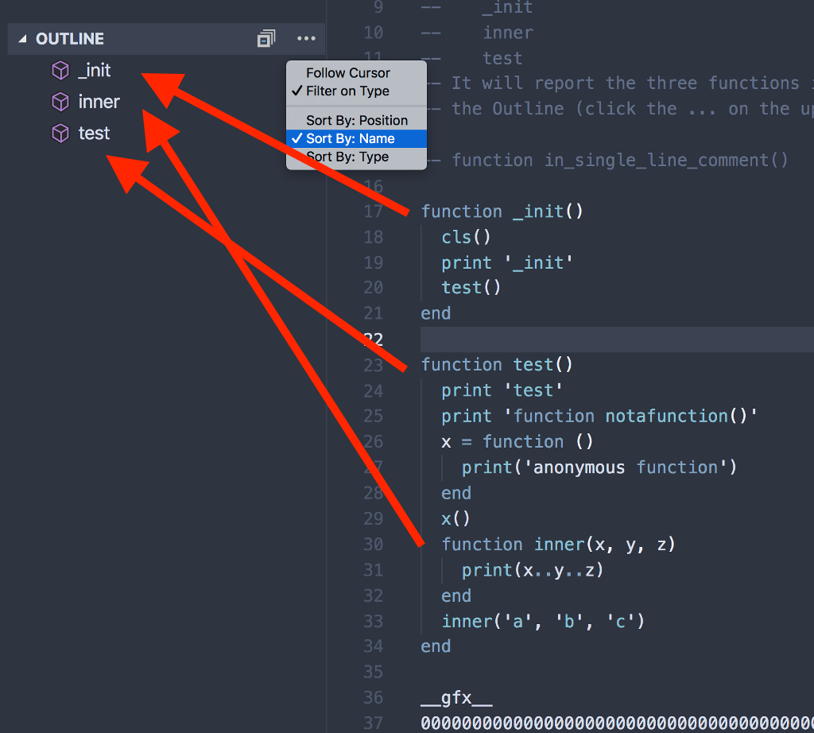
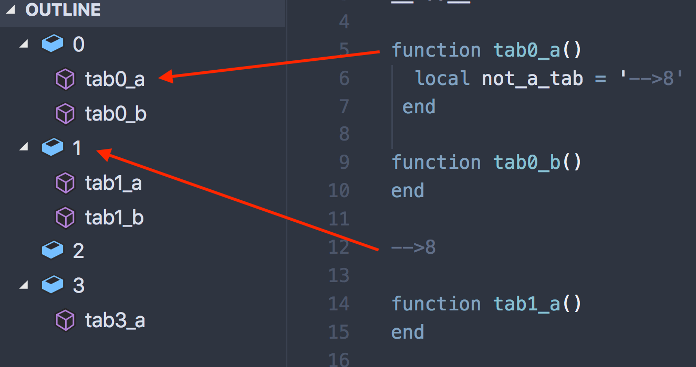

# pico8-simple-outline

This plugin runs this regex:
```
/^ *function /i
```
on *.p8 files to fill the Outline view of Visual Studio Code with function names. It does not attempt to parse PICO-8 Lua syntax. It also runs the regex:
```
/^-->8$/
```
to group functions by tabs, if any.



with tabs:



## Requirements

No dependencies, but it was originally intended to be used with [pico8vscodeeditor](https://github.com/grumpydev/pico8vscodeeditor), and they seem to work together without conflict.

## Known Issues

It would be better to parse the PICO-8 Lua syntax properly, but without that, the simple regular expression described above is used.

It would also be better to load and parse the sample files in automated tests.

## Build and Release

https://code.visualstudio.com/api/working-with-extensions/publishing-extension

## Release Notes

See [CHANGELOG.md](CHANGELOG.md) for more information.
